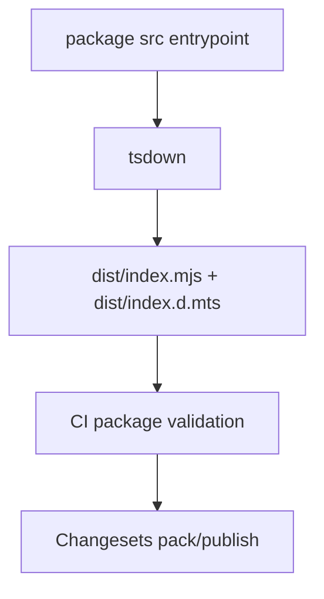

# Yarapa Code Standards: Architecture

Workspace topology, ESLint composition, evaluation order, policy ownership, package boundaries, distribution, and verification surfaces.

## Repository Topology

A public repository with a private root pnpm workspace, orchestrated by Turborepo, that publishes three public packages.

```text
.
├── .changeset/                     # Release intent and semver bump records
├── .agents/rules/                  # Repository invariants selected by task trigger
├── .github/workflows/              # Verify, PR title, triage, preview, and release workflows
├── .husky/                         # commit-msg, pre-commit, and pre-push enforcement
├── .agents/docs/                   # Repository documentation
├── eslint.config.ts                # Root lint config; consumes the built ESLint package
├── packages/eslint-config-yarapa/
│   ├── src/
│   │   ├── configs/                # Private capability configs and private barrel
│   │   ├── types/                  # Internal ambient declarations
│   │   ├── globs.ts                # Shared extensions and file patterns
│   │   ├── factory.ts              # Single Flat Config composition root
│   │   ├── factory.type.ts         # Public factory options type
│   │   └── index.ts                # Public source entrypoint
│   ├── fixtures/                   # Declarative fixture projects
│   ├── test/                       # Behavior, configuration, contract, validation, and autofix tests
│   ├── dist/                       # Generated. Never edited.
│   └── tsdown.config.ts
├── packages/prettier-config-yarapa/
│   ├── src/
│   │   ├── config.ts
│   │   └── index.ts
│   ├── dist/                       # Generated. Never edited.
│   └── tsdown.config.ts
├── packages/commitlint-config-yarapa/
│   ├── src/
│   │   ├── config.ts
│   │   └── index.ts
│   ├── test/
│   ├── dist/                       # Generated. Never edited.
│   └── tsdown.config.ts
├── turbo.json
└── pnpm-workspace.yaml
```

### Source and build flow

1. `packages/*/src/` is the source for package behavior.
2. `tsdown` builds package entrypoints into generated `dist/` outputs.
3. Root `eslint.config.ts` imports `@yarapa/eslint-config-yarapa-imprement-demo` from the workspace build. Turbo makes root lint depend on the ESLint package build.
4. Root lint is not byte-for-byte identical to a consumer calling `yarapa()`: the root config also adds repository-only global ignores and a root-only rule override for `.dependency-cruiser.ts`.

## ESLint Policy Ownership

Yarapa's [policy surface](../../CONTEXT.md) — the enabled rule IDs, severities, options, and file scopes — is written explicitly in Yarapa config modules. Upstream presets are references, never policy authority: a policy change always requires a source diff in this repository, and a dependency update and a policy update are different review events.

`eslint-config-prettier/flat` is the one intentional non-Yarapa layer. It disables formatting-conflict rules and adds no diagnostic policy; explicit Yarapa stylistic rules run after it where Yarapa retains non-Prettier policy.

## Composition and Evaluation Order

Capability configs (defined in [CONTEXT.md](../../CONTEXT.md)) are private modules under `src/configs/`; shared file patterns live in `src/globs.ts`. `src/configs/index.ts` is an intentional private barrel used by `src/factory.ts`; `factory.ts` is the only composition root.

ESLint merges matching Flat Config objects in array order, so later objects can override earlier ones.

### Capability inventory

| Capability        | Scope / condition                       | Role                                                         |
| :---------------- | :-------------------------------------- | :----------------------------------------------------------- |
| `antfu`           | JS + TS                                 | Explicit Antfu consistency rules and plugin setup            |
| `base`            | JS + TS; JS-only supplement             | Core JavaScript policy and JS-only core rules                |
| `yarapa`          | JS + TS; React supplement               | Policy for rules implemented in the standalone Yarapa plugin |
| `eslint-comments` | JS + TS                                 | ESLint directive governance                                  |
| `promise`         | JS + TS                                 | Promise and async-flow policy                                |
| `regexp`          | JS + TS                                 | Regular-expression policy                                    |
| `unused-imports`  | JS + TS                                 | Unused-import / variable policy                              |
| `typescript`      | TS                                      | TypeScript parser and syntax-level rules                     |
| `type-checked`    | TS                                      | Type-aware TypeScript rules through `projectService`         |
| `import-x`        | JS + TS                                 | Module resolution and import policy                          |
| `sonarjs`         | JS + TS                                 | Code-quality and code-smell rules                            |
| `jsdoc`           | JS, TS, and shared required-doc scope   | JSDoc policy                                                 |
| `unicorn`         | JS + TS; React supplement               | Modern JavaScript policy plus React naming exceptions        |
| `perfectionist`   | JS + TS                                 | Deterministic ordering policy                                |
| `node`            | JS + TS; default runtime                | Node runtime globals and rules                               |
| `browser`         | JS + TS; `browser: true`                | Browser runtime globals                                      |
| `react`           | JSX + TSX; React context                | React semantics                                              |
| `jsx-a11y`        | JSX + TSX; React context                | JSX accessibility                                            |
| `react-hooks`     | JSX + TSX; React context                | React Hooks / compiler-oriented rules                        |
| `nextjs`          | Next.js framework files; `nextjs: true` | Framework filename and Yarapa-rule policy exceptions         |
| `vitest`          | TS test/spec files                      | Vitest policy                                                |
| `json`            | JSON / JSONC / JSON5                    | Data-language setup and rules                                |
| `markdown`        | Markdown                                | Markdown policy                                              |
| `package-json`    | `package.json`                          | Package-manifest policy                                      |
| `yaml`            | YAML                                    | YAML policy                                                  |
| `toml`            | TOML                                    | TOML policy                                                  |
| `prettier`        | Matching code configs                   | Disables formatting-conflict ESLint rules                    |
| `stylistic`       | JS + TS; React supplement               | Explicit non-Prettier structural/style policy                |

### Factory order

`src/factory.ts` is the only composition root and owns the exact evaluation order; read it for the current sequence. The rules the order encodes:

- React context is active when `react: true` **or** `nextjs: true`, composing `unicornReact` → `react` → `yarapaReact` → `jsx-a11y` → `react-hooks`. `nextjs: true` therefore implies the React stack, while `react: true` does not imply Next.js.
- Runtime context is `node` by default and `browser` when `browser: true`; it is independent from React and Next.js options.
- `prettier` composes before `stylistic` and React-specific `reactStylistic`, so explicit Yarapa style policy survives the formatting-conflict layer.

The default factory emits 29 Flat Config objects, `react: true` emits 35, and `nextjs: true` emits 38. Re-derive these counts against the built package when touching composition; no test asserts them.

## Public Boundary

`src/index.ts` exposes the default `yarapa` factory and the `YarapaOptions` type. Capability configs, shared globs, and imported plugin instances stay private.

The internal dependency direction is:

```text
public src/index.ts
  → factory.ts
    → private configs/index.ts
      → capability configs
        → shared globs / imported plugins
```

The private `src/configs/index.ts` barrel is intentional and is not a consumer-facing export.

`packages/eslint-config-yarapa/package.json#exports` exposes:

- `.` → `dist/index.mjs` with `dist/index.d.mts` types
- `./package.json` → package metadata

The package `files` list ships `dist/`; npm also includes the package manifest. Internal source modules are not supported consumer entrypoints.

## Build and Distribution

All three packages build with `tsdown` and publish ESM output under `dist/`.



The release workflow verifies a publish commit with `pnpm verify` before packing and publishing through Changesets. The verification command already includes Publint and AreTheTypesWrong.

## Repository Verification

| Surface                     | Location                  | Protects                                                        |
| :-------------------------- | :------------------------ | :-------------------------------------------------------------- |
| **Behavior tests**          | `test/behavior/`          | Observable diagnostics and selected policy behavior             |
| **Configuration tests**     | `test/configuration/`     | Selected composition, context, naming, and ownership invariants |
| **Public API tests**        | `test/public-api/`        | Published export shape                                          |
| **Config-validation tests** | `test/config-validation/` | Parser/project-service resolution against fixture projects      |
| **Autofix tests**           | `test/autofix/`           | Fix behavior and idempotence                                    |

Type-aware behavior uses declarative projects under `packages/eslint-config-yarapa/fixtures/projects/`.

For material pushes, `pre-push` runs `pnpm verify` and then requires 100% diff coverage across the ESLint, Prettier, and Commitlint LCOV reports against the locally available comparison ref. `pnpm verify` generates those reports through `pnpm test:coverage`. The diff check ignores staged and unstaged working-tree edits and complements Codecov's remote patch status without weakening `target: auto`.

PR title validation runs on `pull_request`, not `pull_request_target`, so Changesets version PRs created with `GITHUB_TOKEN` still produce the required `Validate pull request title` status.

`pnpm verify` covers root and package lint/typecheck, EditorConfig and Prettier formatting, manifest ordering, peer dependency contracts, coverage tests, Knip, dependency-cruiser, builds, Publint, and AreTheTypesWrong. Repository CI additionally isolates these concerns into reviewable jobs and adds dependency audit, Codecov upload, changeset validation, consumer smoke, and a compatibility matrix across supported Node/ESLint combinations.

Test admission and pruning policy lives in [`.agents/rules/deterministic-testing.md`](../../.agents/rules/deterministic-testing.md).
